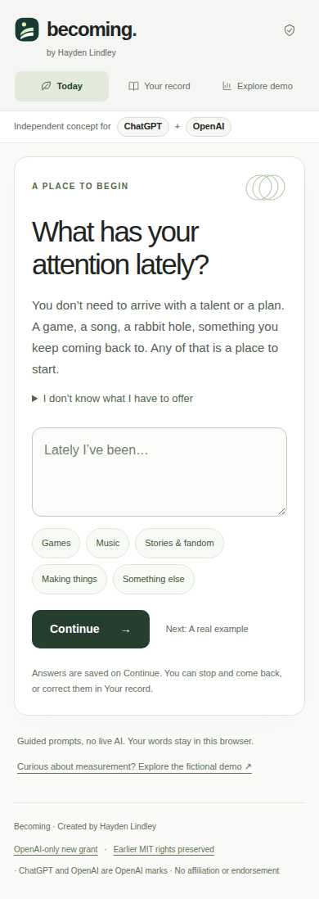
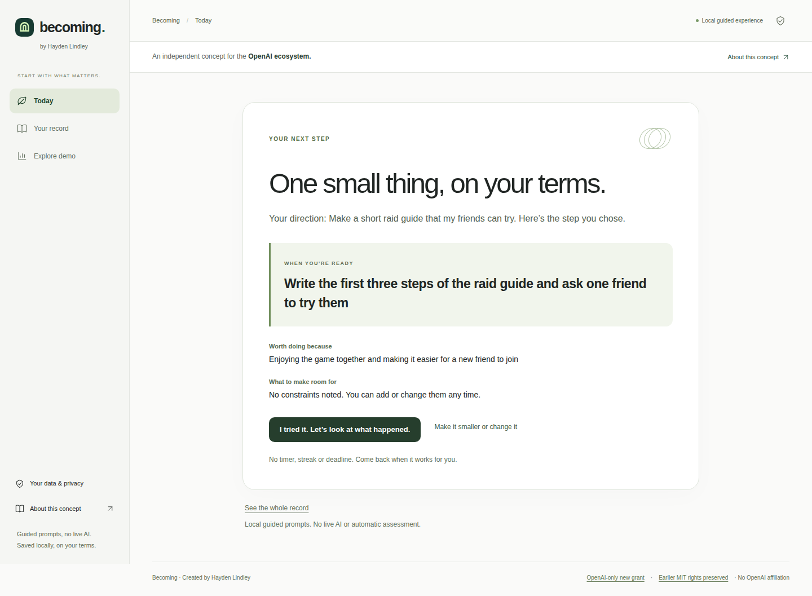
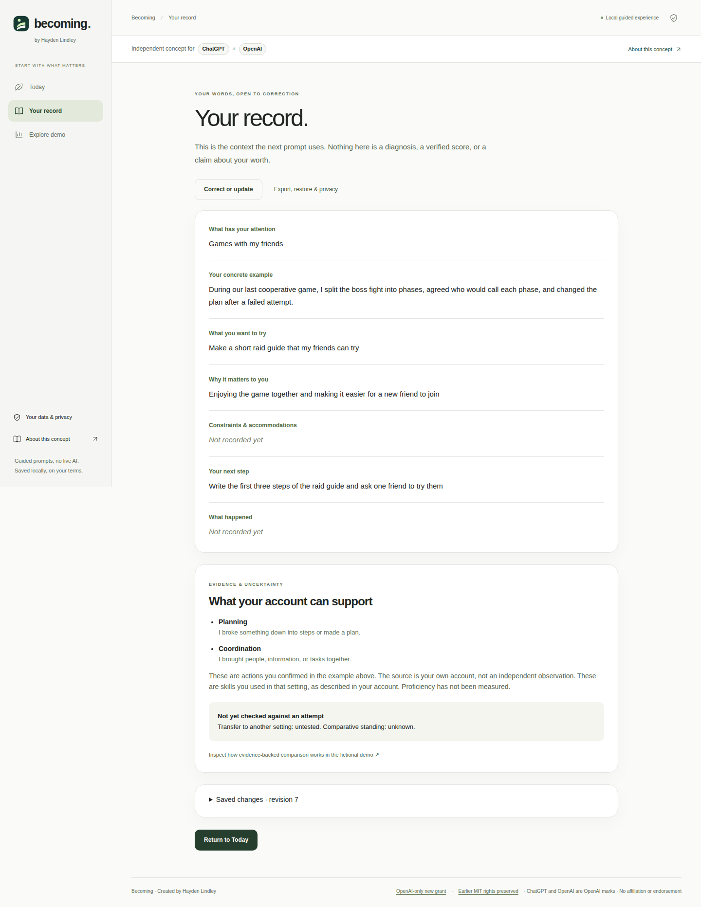

<p align="center">
  
</p>

<h1 align="center">Becoming</h1>

<p align="center">
  <strong>Start with what matters. Find a next step.</strong><br>
  A simple, interest-led experience with an honest record underneath.
</p>

<p align="center">
  An independent concept for <strong>ChatGPT</strong> + <strong>OpenAI</strong>.<br>
  Created by <strong>Hayden Lindley</strong> · No OpenAI affiliation or endorsement
</p>

<p align="center">
  <a href="https://github.com/bohselecta/oai-becoming/actions/workflows/check.yml"></a>
  
  
  
  <a href="LICENSE"></a>
</p>

<p align="center">
  <a href="public/becoming-preview.png"></a>
</p>

<p align="center">
  <a href="https://chatgpt.com">ChatGPT</a> ·
  <a href="https://openai.com">OpenAI</a> ·
  <a href="#install">Run locally</a> ·
  <a href="#core-usage">Walk through it</a> ·
  <a href="docs/PROPOSAL.md">Product thesis</a> ·
  <a href="docs/QA.md">Verification</a>
</p>

## Value

You don't need to arrive with a talent or a plan. Start with a game, a song, a fandom, something you make, or a question you keep returning to. Describe one real example. Notice the skills you used there. Choose something you want to try, a reward that matters to you, and a step that fits your circumstances.

Becoming keeps two layers clear:

- **A simple everyday experience.** One question at a time, then one chosen next step. Your saved answers carry forward when you return.
- **An inspectable record and evidence protocol.** Your own words, decisions and outcomes stay correctable. A separate fictional demo exposes the full comparison and measurement system.

The three destinations are **Today**, **Your record**, and **Explore demo**. Details appear when you ask for them; the first screen never assigns you a fictional score.

**Becoming uses authored guided prompts.** Version 0.3.1 preserves the interest-led experience and adds the new mark and ChatGPT/OpenAI presentation. It has no live language model, automatic skill assessment or account integration. It makes no model or analytics calls. It is a working local experience and a synthetic measurement demonstration, not a validated assessment service.

<p align="center">
  <a href="public/becoming-phone.png"></a>
</p>

<p align="center"><em>Actual phone layout. Continue is visible within a 390 × 844 viewport.</em></p>

## Requirements

- **Node.js 22+** to run checks, build or serve the project
- **Git** for the clone instructions below
- A modern browser with ES modules, native dialogs and local storage
- No API key, database, account connection or runtime npm dependencies

Python and Playwright are needed only for the optional browser tests. If browser storage is blocked or full, Becoming remains usable for that session and shows a persistent warning. Local storage is unencrypted and tied to the browser and origin; it does not sync between devices.

This is a source-visible project with a recipient-limited license. See [Project & license](#project--license) for the current grant and preserved earlier MIT rights.

## Install

```bash
git clone https://github.com/bohselecta/oai-becoming.git
cd oai-becoming
npm run check
npm run dev
```

Open **http://127.0.0.1:4173**. No `npm install` step is needed: the app and build use Node's standard library. The development server listens on loopback only.

For the production build:

```bash
npm run build
npm run preview
```

This creates a modular static site at `dist/index.html` and a self-contained file at `dist/becoming.html`. The portable file includes the app, fictional data, styles, documentation and both legal notices; it runs without network or model calls. Browser policies for saving data from local files vary, so use a served origin for dependable return visits and export backups when moving between them.

## Core usage

### 1. Start with your attention

In **Today**, describe something that interests you, then give one concrete example of what you did. You can use the optional prompts if you don't know what you have to offer. Saved answers resume where you left off; unsent text is not saved.

Confirm only the actions you actually used: planning, coordination, persistence or adaptation. Coordinating a raid is coordination in that setting. The record identifies this as your account, without assigning proficiency or claiming that it transfers to a different setting.

### 2. Choose a step on your terms

Choose an activity you want to pursue, a reward you care about and any constraints or accommodations. Make the next action small enough to try. You can change it, make it smaller, stop and return.

<p align="center">
  <a href="public/becoming-next-step.png"></a>
</p>

After trying it, record what happened and whether it supports your account, contradicts it or leaves you uncertain. Choosing a new step preserves the completed attempt with its original context. Nothing awards a score or guarantees success.

### 3. Inspect and correct your record

**Your record** shows the answers behind the prompts: interests, examples, confirmed actions, direction, reward, constraints, next step and outcomes.

<p align="center">
  <a href="public/becoming-record.png"></a>
</p>

Correcting an example clears its old skill confirmations until you reconfirm them. Correcting a current step clears its dependent result. Earlier completed attempts remain tied to their original accounts and can be inspected or removed. Up to 20 attempts are retained without silently pruning history. At the limit, export a copy if you want to keep it, then explicitly remove an earlier attempt before adding another.

Use **Your data & privacy** to download a full backup, validate and restore a backup, or explicitly erase the local record. Backups include your private text and are not uploaded. Corrupt or incompatible saved data stays recoverable before replacement. Erasing the local record cannot remove copies you already downloaded.

### 4. Explore the evidence underneath

**Explore demo** opens the complete comparative instrument with **120 fictional participants**. It is separate from your personal record: entering an interest, completing a step or describing a skill never changes a demo score.

Inspect the Becoming Index, capability standings, compatible comparisons, the person just ahead, Surpass Projects, movement, evidence and consent controls. Every score exposes its evidence basis, assistance condition, date and coverage. Valid low scores stay visible; unknown stays unknown. Independent and AI-assisted results remain separate.

Try the full evidence loop: choose a comparison, create a project, complete its practice, submit a synthetic demonstration, inspect it and accept or reject it. Only accepted eligible evidence changes placement. Revocation removes its contribution again.

[Measurement architecture](docs/ARCHITECTURE.md) · [Data contracts](docs/DATA-CONTRACTS.md) · [Acceptance walkthrough](docs/ACCEPTANCE.md)

All four images above are captures of the running 0.3.1 interface, not mockups. The example record was entered by browser tests. They match the served captures at [`d0b082da`](https://github.com/bohselecta/oai-becoming/commit/d0b082dae183cd439ad3a140819c011eb443af47), including the new mark and ChatGPT/OpenAI treatment. [Screenshot provenance](docs/verification/0.3.1-branding.json).

## Advanced configuration

### Serving and static hosting

Set `PORT` to change the local server port, for example `PORT=4174 npm run dev` in a POSIX shell. No other environment variables or secrets are required.

The checked-in `vercel.json` supports a static GitHub → Vercel setup with the repository root as the project root, `npm run build` as the build command and `dist` as the output directory. It includes security headers and a `connect-src 'none'` policy. Hosting is optional; this repository does not claim a verified production deployment.

### Verification

```bash
npm run check
```

This runs **152 Node tests** and builds both formats. The [Product verification workflow](https://github.com/bohselecta/oai-becoming/actions/workflows/check.yml) also runs both browser suites against the served site and the portable file, recording the exact source revision, JSON receipts and screenshots.

To run browser verification locally after building:

```bash
python -m pip install -r tests/requirements.txt
python -m playwright install chromium

# Portable build
python tests/browser_smoke.py
python tests/discovery_browser.py

# Served build: run npm run preview in another terminal first
python tests/browser_smoke.py --url http://127.0.0.1:4173
python tests/discovery_browser.py --url http://127.0.0.1:4173
```

The [0.3.1 branding verification run](https://github.com/bohselecta/oai-becoming/actions/runs/36791725253) at `d0b082da` passed **1,061 browser assertions**: 238 comparative and 297 discovery checks on the served site, plus 232 comparative and 294 discovery checks on the portable build. It reported no runtime errors or external requests. [The versioned receipt](docs/verification/0.3.1-branding.json) records that exact source and the screenshot hashes. Check the workflow for the exact current commit; a historical receipt does not verify later changes.

Coverage includes context on return, contradictory outcomes, corrections, preserved attempts, backup validation, recovery, storage failures, keyboard/focus behavior and desktop/phone layouts. Human first-use studies, a screen-reader audit and real-device Safari testing remain outstanding. See [QA and execution limits](docs/QA.md).

### Extending the project

`src/journey.js` owns the validated personal record; `src/discovery.js` presents the guided flow. `src/domain.js` and `src/participants.js` own the separate synthetic measurement model. Keep these boundaries intact.

Read the [discovery contract](docs/DISCOVERY-CONTRACT.md), [architecture](docs/ARCHITECTURE.md), [data contracts](docs/DATA-CONTRACTS.md) and [current status](docs/STATUS.md) before changing behavior. Real assessment would require authorized participant and evidence services, reviewer provenance, correction and withdrawal handling, and empirical measurement validation. No configuration switch turns the fictional demo into a real assessment.

## Project & license

**Becoming** is the first-person instrument. **Emergence** is a separate world-facing concept; neither project requires the other to run. Becoming keeps its own name, original forest-green visual identity and authorship. Version 0.3.1 introduces a simpler person-and-rising-path mark designed to read cleanly at modern AI-app icon scale without imitating OpenAI or another provider. “An independent concept for ChatGPT + OpenAI” makes the intended ecosystem explicit while remaining a secondary descriptor, not an integration, partnership or endorsement. See the [brand standard](docs/BRAND.md).

Copyright © 2026 **Hayden Lindley**. New original material is offered under the **[Becoming OpenAI-Only License 1.0](LICENSE)**, first introduced with 0.2.1. This is a custom, recipient-limited grant, not a general open-source license. The license defines the eligible OpenAI entities and permitted uses.

The earlier 0.2.0 MIT grant remains intact, including for retained material covered by it. Read the [license history](docs/LICENSE-HISTORY.md), [original MIT notice](licenses/MIT-legacy.txt) and [permission summary](docs/PERMISSION.md) for that boundary. The custom license has not been reviewed by counsel.

<p align="center">
  <br>
  <strong>Becoming</strong><br>
  Know your place. Change it.
</p>

<p align="center">
  <a href="docs/PROPOSAL.md">Proposal</a> ·
  <a href="docs/EVALUATION.md">Evaluation</a> ·
  <a href="CONTRIBUTING.md">Contributing</a> ·
  <a href="CHANGELOG.md">Changelog</a>
</p>
