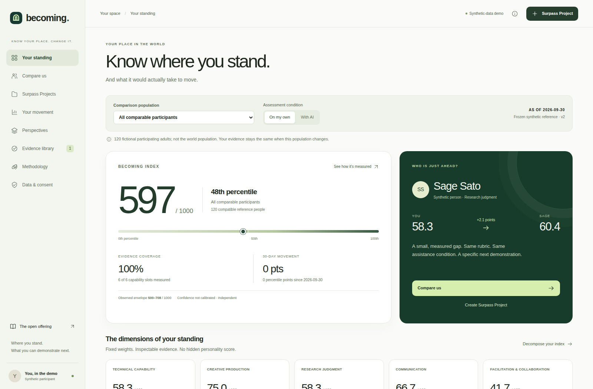

# Becoming
### Know your place. Change it.

**Where am I among other people—and what would it actually take to move?**

An evidence-backed comparative development instrument: your standing, the people just ahead, the differences that matter, and a concrete project that can turn new evidence into movement.

[](https://github.com/bohselecta/oai-becoming/actions/workflows/check.yml)


<p align="center"></p>

*Screenshot of the running product. The demo calculates this starting fixture: 597/1000, 48th percentile, 100% evidence coverage. These describe authored synthetic data, not the visitor.*

**Release:** complete comparative product demonstration · **Verified:** 90 domain tests and 207 hosted-browser assertions · **Offering:** original source, assets and documentation free to use under MIT, including by OpenAI.

[Product thesis](docs/PROPOSAL.md) · [Measurement & architecture](docs/ARCHITECTURE.md) · [Executed verification](docs/QA.md) · [Permission for OpenAI](docs/PERMISSION.md)

---

## 1. A real comparison. A demonstrable next move.

Becoming starts with placement, not a list of things to keep you busy. A valid low percentile remains visible. The next question is practical: **who is slightly ahead, what does the evidence actually show, and what could I demonstrate to cross that threshold?**

Standing, coverage and movement are separate. Every index decomposes into its dimensions, capabilities, assessments and evidence. A completed checklist or an adopted practice never awards competence; only accepted, eligible evidence can move the score.

| Surface | What works |
|---|---|
| **Your standing** | A calculated 0–1000 Becoming Index, named-cohort percentile, evidence coverage, observed envelope and movement. |
| **Compare us** | Six-capability person comparisons, measurable gaps, reference evidence and intentionally shared practices. |
| **Who is just ahead?** | The smallest compatible positive gap in a chosen capability—not an invented rival or an easier hidden population. |
| **Surpass Projects** | Frozen targets, cohort, rubric, condition, current evidence, demonstration steps, human review and portable briefs. |
| **Your movement** | Actual derived history, score/percentile changes, coverage changes and condition-specific trajectories. |
| **Evidence & methodology** | Inspect, accept, reject or revoke demonstrations; trace every score to its basis. |
| **Data & consent** | Disconnect source grants, pause comparisons, export a selective packet or reset browser-local state. |

The calm forest-green identity, editorial spacing, geometric art, six original capabilities and evidence-review foundation are preserved. Becoming is the **first-person instrument**; Emergence is a separate world landscape. This product runs on its own.

## 2. Requirements

**Application/build:** Node.js 22 or newer and a modern browser with ES modules and native dialogs. There are **no npm packages to install, no API keys, no database and no runtime account connections**.

**Optional browser verification:** Python with the development-only dependencies in `tests/requirements.txt`, plus a Playwright Chromium installation. These are not bundled into the product.

The demo contains 120 fictional participants, eight named fixture populations and four authored Perspective bundles. It does not assess the visitor, read chat history, connect to provider accounts or claim empirical validity. Real participants and validated population norms are a separate production gate.

## 3. Get started

```bash
git clone https://github.com/bohselecta/oai-becoming.git
cd oai-becoming
npm run check
npm run dev
```

Open **http://127.0.0.1:4173**. The server listens only on loopback. No environment configuration is required; `.env.example` documents the optional local port.

### Portable, offline product

```bash
npm run build
```

Open **`dist/becoming.html`** in a browser. It contains the working interface, fixture data, styles and downloadable documentation. No network or model calls are needed. Browsers that block local-file storage fall back to a functioning session-only demo and display a notice.

### GitHub → Vercel

Import this repository into Vercel with root directory **`.`**. The included configuration uses `npm run build`, output directory **`dist`**, and no environment variables. The hosted entry is the modular `index.html`; `/becoming.html` is served as a downloadable attachment.

No new paid service is required by the application. Hosting-account limits remain the owner's responsibility. Source publication does not itself establish that a Vercel project is connected or deployed.

## 4. Try the complete loop

Start on **Your standing**: the synthetic subject has an index of **597**, at the **48th percentile** among 120 comparable fixture participants. Inspect **Research judgment**, then change the cohort. The underlying ability stays the same even when its percentile changes.

Return to all comparable participants. **Sage Sato** is the nearest-ahead research fixture: **60.4/100** versus the subject's **58.3/100**. Open **Compare us**, inspect the evidence and create a **Surpass Project**. Its target and assistance condition remain frozen even when you later change the interface context.

Complete the steps and replay the expressly synthetic demonstration. The score does **not** change while it is pending. Inspect and accept its evidence: the index becomes **615**, the composite percentile becomes **49th**, and the movement history shows the actual change. Revoke that evidence to see the correction propagate.

Next, adopt a Perspective, disconnect a source, inspect a partial index and download a selective capability packet. Practice adoption does not increase proficiency. Unknown evidence does not become zero. The Markdown project brief is portable; importing it into another product is manual, not an account integration.

## 5. Measurement and privacy

The index gives each supported capability a fixed 1/6 weight. Missing capabilities are excluded, with coverage disclosed, and reference people are compared on the same observed basket. Three distinct eligible demonstrations are required; up to the latest twelve within the 180-day fixture window contribute. Independent and AI-assisted observations remain separate.

The observed envelope is **not a confidence interval**. These are transparent engineering fixtures, not calibrated psychological or population measurements. Names identify synthetic records, not claims about real people. Unsupported life domains are not invented to make a dashboard look complete.

Everything runs locally in the browser. Titles and notes are escaped, source grants are revocable, exports exclude raw evidence and private notes, and local persistence is version-checked. Browser storage is not encrypted or tamper-proof; do not enter sensitive real assessment material into this demonstration.

## 6. Verify, extend and maintain

```bash
npm test                         # 90 domain assertions
npm run build                    # modular site + portable HTML
npm run preview                  # serve production output locally

python -m pip install -r tests/requirements.txt
python -m playwright install chromium
python tests/browser_smoke.py     # complete offline-product acceptance
# With the preview server running in another terminal:
python tests/browser_smoke.py --url http://127.0.0.1:4173
```

The local offline run passed **203 assertions**. The subsequent [GitHub hosted-origin run](https://github.com/bohselecta/oai-becoming/actions/runs/36762047466) passed **207 assertions**, including modular loading, served CSP and origin-localStorage reload behavior. Both exercised nine routes, responsive widths, keyboard operation, downloads and the complete comparative flow. See the [hosted receipt](docs/verification/HOSTED.md), its [machine-readable result](docs/verification/hosted-browser-results.json), and the historical [QA record](docs/QA.md). This verifies the served product on the runner, not a live Vercel deployment, measurement calibration or a screen-reader audit.

| Document | Purpose |
|---|---|
| [Architecture](docs/ARCHITECTURE.md) | Exact arithmetic, source eligibility, comparison boundaries, state transitions and build. |
| [Data contracts](docs/DATA-CONTRACTS.md) | Participant, evidence, frozen target, history and disclosure schemas; real-adapter obligations. |
| [Evaluation](docs/EVALUATION.md) | Prospective measurement validation and comparative-product study gates. |
| [Acceptance](docs/ACCEPTANCE.md) | Required vertical slice and negative cases. |
| [QA](docs/QA.md) | Tests actually run, fixes made and remaining limitations. |
| [Provenance](docs/PROVENANCE.md) | Live-source baseline, retained identity and asset/dependency origins. |
| [Agent contract](AGENTS.md) | Frozen comparative invariants for Codex, Antigravity and maintainers. |

The source is split between `participants.js`, `domain.js`, `app.js` and the retained/extended CSS system. There are no backend stubs pretending to be integrations. The next production work is an authorized real-evidence/participant adapter and validation, not an opaque AI score.

## 7. License, offering and support

Copyright © 2026 **Hayden Lindley**. Original repository materials are available under the [MIT License](LICENSE), including free commercial reuse by **OpenAI and anyone else**. [The permission notice](docs/PERMISSION.md) explains the scope without adding restrictions to MIT.

This is an independent public offering—not an OpenAI product, endorsement, partnership, acknowledgement of receipt or claim of acceptance. Private conversations, other people's identities and third-party rights are not released by this repository.

For reproducible defects and product proposals, use this repository's Issues. See [Contributing](CONTRIBUTING.md) and [Changelog](CHANGELOG.md). Keep real personal records and credentials out of issue reports.
