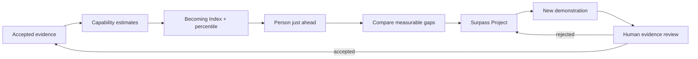
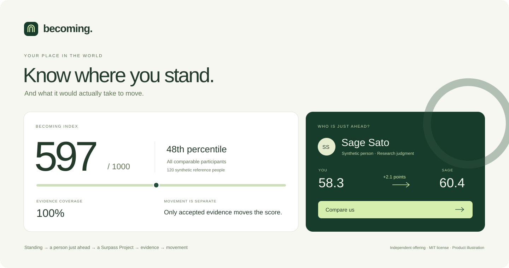

<p align="center">
  
</p>

<h1 align="center">Becoming</h1>

<p align="center">
  <strong>Know your place. Change it.</strong><br>
  An independent concept for the OpenAI ecosystem.
</p>

<p align="center">
  Created by <strong>Hayden Lindley</strong> · Not affiliated with, sponsored by, or endorsed by OpenAI
</p>

<p align="center">
  <a href="https://github.com/bohselecta/oai-becoming/actions/workflows/check.yml"></a>
  
  
  
  <a href="LICENSE"></a>
</p>

<p align="center">
  
</p>

**Start with what matters. Keep an honest record. Find a next step.**

Becoming starts with something you already care about: a game, music, a fandom, making things, or a question you keep coming back to. Describe a real example, notice what you actually did, and choose something small you want to try. You choose the reward and the constraints. There is no profile survey, talent prerequisite or assigned life goal.

The simple surface rests on two explicit records: your own correctable browser-local context, and a separate, inspectable **synthetic comparative instrument**. That instrument retains every evidence gate, honest low score, comparison condition and revocation path. Unknown stays unknown. A task, a self-description or a completed checklist never awards competence.

**This version uses authored guided prompts, not a live language model.** It makes no model calls, diagnoses nothing and does not assess the visitor. It can remember your saved answers in this browser, export/restore them, and use them in the next prompt. The detailed demo shows how evidence-backed comparison could work with legitimately assessed data.

<p align="center">
  <a href="docs/PROPOSAL.md"><strong>Product thesis</strong></a> ·
  <a href="docs/ARCHITECTURE.md"><strong>Measurement & architecture</strong></a> ·
  <a href="docs/ACCEPTANCE.md"><strong>Acceptance contract</strong></a> ·
  <a href="docs/QA.md"><strong>Verification</strong></a> ·
  <a href="docs/BRAND.md"><strong>Brand standard</strong></a>
</p>

---

## 1. What Becoming does

The first-use loop is **interest → real example → user-confirmed actions → wanted activity → meaningful reward → constraints → small next step → what happened**. One question is shown at a time. You can stop after any saved answer and return without retelling it.

### Three places, two layers

- **Today:** the next question or the step you chose, using your saved context
- **Your record:** inspect and correct the actual answers, selected actions, uncertainty, outcomes and change history; export, restore or erase locally
- **Explore demo:** the complete fictional measurement instrument, with all its detail on demand

Planning a game strategy, coordinating people, persisting through an encounter or adapting a build can exercise real skills in that setting. Becoming records only the actions you explicitly confirm in a concrete account. That is self-report, not independently observed proficiency. Transfer to another setting remains a separate, untested question. An outcome can support your account, contradict it or remain uncertain; no score moves.

The comparative loop inside the explicit demo remains:



The intended emotional sequence is equally simple:

**truth → understanding → attainable comparator → action → evidence → movement**

### Retained surfaces inside Explore demo

| Surface | Purpose |
|---|---|
| **Your standing** | Shows the 0–1000 Becoming Index, contextual percentile, evidence coverage, observed envelope, movement, date, and assistance condition. |
| **Capability standings** | Breaks placement into the six capabilities the demo can currently support without inventing unsupported life measurements. |
| **Compare us** | Compares two people on the same evidence basis and explains only differences the measurements justify. |
| **Who is just ahead?** | Finds the smallest compatible positive gap in a selected capability rather than defaulting to an unreachable #1. |
| **Surpass Projects** | Freezes the comparator, cohort, rubric, condition, current evidence, target, and demonstration required to cross a measurable threshold. |
| **Movement** | Separates current placement from trajectory and records actual score, percentile, coverage, and evidence changes over time. |
| **Evidence & methodology** | Exposes the provenance and review state behind every score. |
| **Data & consent** | Supports source revocation, comparison pause, selective export, and local-state reset. |

Becoming is the **first-person instrument**. A separate product such as Emergence can map populations and exceptional people, but Becoming does not depend on that product to function.

---

## 2. The product in one view

<p align="center">
  
</p>

Opening **Explore demo** shows a fully synthetic fixture, separate from your record:

- **Becoming Index:** 597 / 1000
- **Composite placement:** 48th percentile
- **Evidence coverage:** 100%
- **Reference population:** 120 comparable synthetic participants
- **Nearest-ahead research comparator:** Sage Sato, 60.4 vs. 58.3
- **Demonstrated movement path:** 597 → reviewed evidence → 615

Those numbers are not claims about the visitor or about real people. They exist to make the complete measurement and interaction model inspectable.

### What you can inspect in the fictional demo

1. See the synthetic participant’s placement immediately.
2. Inspect the evidence behind a capability.
3. Change the comparison population without changing underlying ability.
4. Switch independent and AI-assisted conditions.
5. Find a synthetic person just ahead.
6. Compare the measurable differences.
7. Create a Surpass Project from that exact gap.
8. Complete a synthetic demonstration.
9. Review the resulting evidence.
10. Accept it and observe legitimate score/rank movement.
11. Revoke evidence and watch the dependent measurements correct themselves.

---

## 3. Why the measurement is inspectable

The point of ranking is not to manufacture certainty. It is to make **valid comparison useful**.

### Becoming preserves these invariants

- **Unknown is not zero.** Missing evidence lowers coverage; it does not fabricate a poor score.
- **Coverage is not ability.** A 24% observed profile cannot present itself as a complete human measurement.
- **Conditions stay separate.** Independent and AI-assisted performance are never silently blended.
- **Rubrics are versioned.** Comparable evidence must share a defined assessment basis.
- **Provenance survives scoring.** Every estimate can be traced back to eligible demonstrations and sources.
- **Human review gates movement.** Pending evidence cannot change placement.
- **Project completion is not competence.** Checking every box in a Surpass Project awards nothing by itself.
- **Perspective adoption is not skill transfer.** Trying another person's practice does not copy their score, identity, credentials, or reputation.
- **Invalid comparisons are rejected.** The product does not invent a friendlier population when a legitimate comparison is unavailable.
- **Synthetic people stay synthetic.** The current comparator records are fixtures designed for later replacement by authorized real-participant data.
- **No personality inference.** Output differences do not become claims about confidence, discipline, motives, intelligence, or worth.
- **The composite is decomposable.**

```text
Becoming Index
└── supported capabilities
    └── condition-specific estimates
        └── assessments
            └── accepted evidence
                └── source + rubric + provenance
```

The index is a composite of the dimensions the system can currently evaluate—not a score of intrinsic human worth.

For the exact arithmetic, eligibility rules, recency window, cohort compatibility, and frozen Surpass Project contracts, read **[Architecture](docs/ARCHITECTURE.md)** and **[Data contracts](docs/DATA-CONTRACTS.md)**.

---

## 4. Run Becoming locally

### Requirements

- **Node.js 22+**
- A modern browser with ES modules and native `<dialog>`
- No API key
- No database
- No account connection
- No runtime npm dependencies

The optional browser suite uses Python + Playwright as development-only tooling.

### Install

```bash
git clone https://github.com/bohselecta/oai-becoming.git
cd oai-becoming

npm run check
npm run dev
```

Open:

```text
http://127.0.0.1:4173
```

The development server binds to loopback only.

### Build the portable product

```bash
npm run build
```

The build produces:

```text
dist/
├── index.html          # modular hosted entry
├── becoming.html       # single-file portable product
├── src/
├── public/
├── docs/
├── licenses/
└── LICENSE
```

`dist/becoming.html` contains the application, fixture data, styles, current legal notice, legacy MIT notice, and documentation needed to run the demonstration without network or model calls.

### Deploy through GitHub → Vercel

The repository already includes `vercel.json`.

| Setting | Value |
|---|---|
| Root directory | `.` |
| Build command | `npm run build` |
| Output directory | `dist` |
| Environment variables | none required |

Source publication is **not** a deployment. This repository does not claim a live Vercel release until one has actually been connected and verified.

---

## 5. Verify the product

### Automated checks

```bash
npm test
npm run build
npm run preview
```

Optional browser verification:

```bash
python -m pip install -r tests/requirements.txt
python -m playwright install chromium

# Portable/offline acceptance
python tests/browser_smoke.py
python tests/discovery_browser.py

# Served-origin acceptance, with preview running separately
python tests/browser_smoke.py --url http://127.0.0.1:4173
python tests/discovery_browser.py --url http://127.0.0.1:4173
```

### Current review evidence

The interest-led branch currently passes **140 Node domain/presentation/package tests** and both production builds. Browser acceptance is being run in GitHub CI because this authoring environment blocks browser process sockets and loopback navigation. Check the exact draft-PR head and its receipts before claiming a browser pass. Prior 0.2.1 receipts are historical, not evidence for this revision.

- [Current status](docs/STATUS.md)
- [QA record](docs/QA.md)
- [Frozen discovery contract](docs/DISCOVERY-CONTRACT.md)
- [Preserved measurement acceptance](docs/ACCEPTANCE.md)

### Repository layout

```text
oai-becoming/
├── src/
│   ├── app.js               # product UI and interactions
│   ├── journey.js           # validated personal record and storage boundaries
│   ├── discovery.js         # authored conversational presentation
│   ├── discovery.css        # interest-led visual hierarchy
│   ├── domain.js            # unchanged measurement and synthetic state model
│   ├── participants.js      # synthetic comparator fixtures
│   ├── styles.css           # retained Becoming design system
│   └── comparative.css      # comparative-product additions
├── public/
│   ├── mark.svg
│   ├── becoming-preview.png # actual verified product screenshot
│   └── becoming-hero.svg    # product illustration
├── tests/
│   ├── domain.test.mjs
│   ├── comparative.test.mjs
│   ├── license-brand.test.mjs
│   └── browser_smoke.py
├── docs/
├── licenses/
├── scripts/
├── LICENSE
└── vercel.json
```

The next work is human first-use testing of this interest-led flow. Real assessment would additionally require an authorized participant/evidence adapter and empirical measurement validation.

---

## 6. Product status and limits

Becoming 0.3.0 combines a **working local interest-led experience** with the complete comparative demonstration. It is not a calibrated real-world assessment service or a live AI companion.

### Implemented

- guided interest-led journey and chosen next step
- correctable local context, uncertainty and outcomes
- private backup export/restore, recovery and explicit erase
- evidence-backed capability estimates
- decomposable Becoming Index
- contextual percentile placement
- cohort switching
- independent / AI-assisted separation
- synthetic person profiles
- Compare Us
- nearest-ahead comparator search
- Surpass Projects
- reviewed evidence movement
- revocation propagation
- trajectory/history
- methodology inspection
- selective export
- responsive and keyboard-accessible behavior
- portable offline build

### Still deliberately synthetic or unverified

- real participant identities and measurements
- national or occupational population norms
- psychometric calibration
- participant studies
- production authentication
- OpenAI account integration
- OpenAI API/model calls
- screen-reader audit
- live Vercel deployment
- OpenAI endorsement, sponsorship, or acceptance

The demo contains **120 fictional participants**, **eight named fixture populations**, and **four authored Perspective bundles**. That boundary is intentional: the interface is ready for real evidence, but it does not fabricate it.

---

## 7. OpenAI offering, brand position, and license

### Independent ecosystem concept

Becoming uses its **own name, mark, visual system, and product hierarchy**. The phrase **“An independent concept for the OpenAI ecosystem”** is descriptive supporting copy, not a joint brand or partnership claim.

No OpenAI Blossom, OpenAI wordmark, ChatGPT icon, proprietary OpenAI typeface, model name, or lookalike mark is used as Becoming's identity. The project does not claim to be official, certified, integrated, accepted, or endorsed.

See **[Brand standard](docs/BRAND.md)**.

### OpenAI-only grant for new material

Copyright © 2026 **Hayden Lindley**.

New original material first published with 0.2.1 is offered under **[Becoming OpenAI-Only License 1.0](LICENSE)**. The defined OpenAI entities receive a worldwide, royalty-free, nonexclusive right to use, modify, integrate, and commercialize that material subject to the license terms.

This is a **public, source-visible repository**, but the new grant is **not a general open-source license** for unrelated companies, independent developers, customers, or ecosystem participants.

### Earlier MIT rights remain intact

Version 0.2.0 was already released under MIT. Those permissions are **not revoked or narrowed**, including for material retained from that release.

- [License history](docs/LICENSE-HISTORY.md)
- [Legacy MIT notice](licenses/MIT-legacy.txt)
- [OpenAI permission summary](docs/PERMISSION.md)

The custom 0.2.1 license has not been reviewed by counsel. Qualified legal review is appropriate before relying on it for commercial enforcement or a formal transfer.

---

<p align="center">
  
</p>

<p align="center">
  <strong>Becoming</strong><br>
  Know your place. Change it.
</p>

<p align="center">
  <a href="docs/PROPOSAL.md">Proposal</a> ·
  <a href="docs/ARCHITECTURE.md">Architecture</a> ·
  <a href="docs/EVALUATION.md">Evaluation</a> ·
  <a href="docs/QA.md">QA</a> ·
  <a href="CONTRIBUTING.md">Contributing</a> ·
  <a href="CHANGELOG.md">Changelog</a>
</p>

<p align="center">
  Independent concept for the OpenAI ecosystem · No affiliation or endorsement implied
</p>
